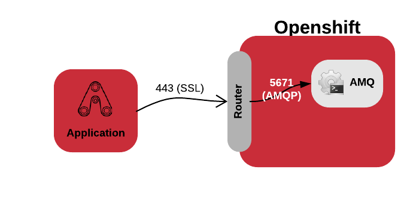

# External application using a AMQ Broker in Openshift

The external application is a Fuse Integration Services / Camel.

## Introduction

Openshift uses a router to expose applications to the external world. This access is via HTTP/HTTPS 
but sometimes you need to connect using non HTTP connection. e.g: databases, message broker.

[There is some ways to achieve it](https://docs.openshift.com/container-platform/latest/dev_guide/expose_service/index.html).

* [Port forwarding](https://docs.openshift.com/container-platform/latest/dev_guide/port_forwarding.html)
* [Node Port](https://docs.openshift.com/container-platform/latest/dev_guide/expose_service/expose_internal_ip_nodeport.html)
* [Router](https://docs.openshift.com/container-platform/latest/dev_guide/expose_service/expose_internal_ip_router.html#getting-traffic-into-cluster-router)

I choose the Router option to demonstrate in this example. As the web applications in Openshift usually is exposed via router 
this method is the most common and known one. Using the router to expose non HTTP traffic it need to use HTTPS/TLS (SNI).

This approach needs that you need some control to the client application because it must to trust in the 
broker certificate. If you do not have any control to the client application you need to choose another approach, maybe 
node port.

## Hands on

1) Generating the certificates
First we need to create the certificates, to make it easier I made a script [certs-setup.sh](./openshift-setup/certs-setup.sh). Adjust with your own values and run it.
    
Look at the generated files. The [amq-server.ks](openshift-setup/amq-server.ks) will be used in the AMQ broker and the [amq-client.ts](openshift-setup/amq-client.ts)
in the client application (external to the Openshift).

2) Setup the AMQ Broker in Openshift

Once that the certificates is already generated, we could do the AMQ Broker setup. To make it easier I made the script [setup.sh](./openshift-setup/setup.sh). Adjust with your values and pay attention to the comments to better ajust to your case.

3) Run the client application 

I used Fuse Integration Services to built this client application, but it could be any application, in any language because it uses AMQP+SSL protocol.

To run, first adjust the file [application.properties](src/resources/application.properties) with the broker values, host, user, passwd.

Finally run the application: 

    mvn spring-boot:run

If you would like to troubleshooting, run with the script `run-debug-ssl.sh`.

